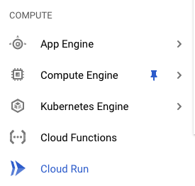
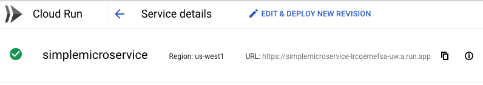

# Build and Deploy Microservice to Cloud Run

Cloud Run ia a managed compute platform to run stateless containers. I am using a simple Java Microservice to build and deploy to Cloud Run. Here are the following steps

1. Github or the Cloud Source Repository where the Microservice code is loacted

2. Dockerfile to build and publish to Container Registery

3. Deploy to Cloud Run

4. Test the App

## 1. Cloud Source Repository (GIT) where the Microservice code is loacted

The code is located in the current directory (simple_micro_service) is used for build and deployment.

## 2. Dockerfile to build and publish to Container Registery

Create a Dockerfile with the build instructions. 

## 3. Deploy to Cloud Run

Use gcloud command to deploy the container image to the Cloud Run

gcloud run deploy --image gcr.io/broadcom-gcp-migration-pocs/simple_micro_service --platform managed

Go to the Cloud Run from the Google Cloud Console

Select the deployed service (simplemicroservice)

## 4. Test the App

The Cloud Run UI will expose the link (https://simplemicroservice-lrcqemefsa-uw.a.run.app) and use that link to verify the Microservice is working fine.

